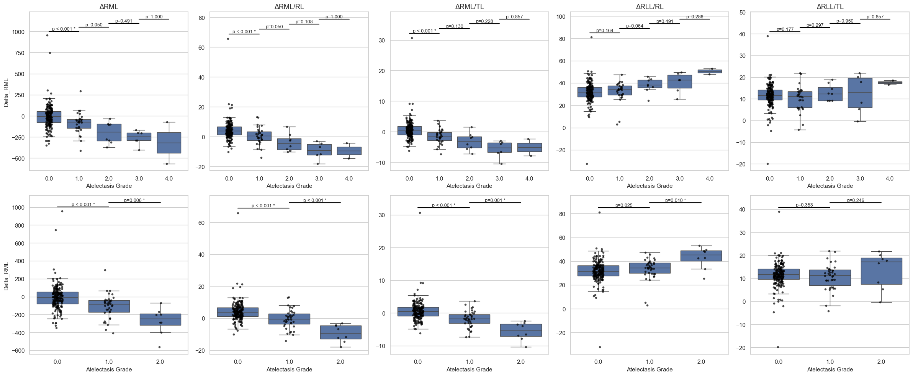
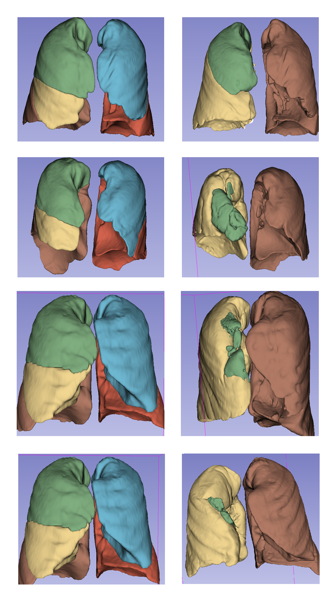

# Deep Learning–Based Quantitative Evaluation of Postoperative Atelectasis

## Overview
This repository contains code and resources for an automated deep learning–based pipeline to quantify postoperative atelectasis following right upper lobectomy using paired pre- and postoperative CT scans.  
We trained and validated **nnU-Net v2** segmentation models to delineate lobar anatomy in both preoperative and postoperative settings, enabling reproducible volumetric analysis and grading of atelectasis.

## Key Features
- Two separate **nnU-Net v2** segmentation models for preoperative and postoperative lobar segmentation.
- Automated volumetric quantification of lobar volume loss as a surrogate for atelectasis severity.
- Validation against physician-assigned grades using a standardized 5-point radiological scale.
- Generalizable performance across vendors, scanners, and acquisition protocols.
- External validation on the public **LOLA11 lung lobe segmentation challenge** dataset.

## Dataset
- **Internal Stanford cohort**: 236 patients (2008–2023) with paired CT scans.
- **External dataset**: OttawaChestCT for preoperative training, LOLA11 for external validation.
- DICOMs converted to NIfTI format; preprocessing and postprocessing handled via nnU-Net pipeline and customized postprocessing.

## Model Performance
- **Preoperative model**: Mean Dice ≈ 0.98 (internal), 0.92 (LOLA11).
- **Postoperative model**: Mean Dice ≈ 0.99 (internal).
- Progressive decline in right middle lobe volume correlates with increasing atelectasis severity.

## Figures

  

  

## Model checkpoints (preop and postop) avaialable for download here:
[10.6084/m9.figshare.29877509](https://figshare.com/articles/software/_b_Deep-learning_based_quantitative_evaluation_of_postoperative_atelectasis_following_right_upper_lobectomy_b_/29877509)

## Cite:
